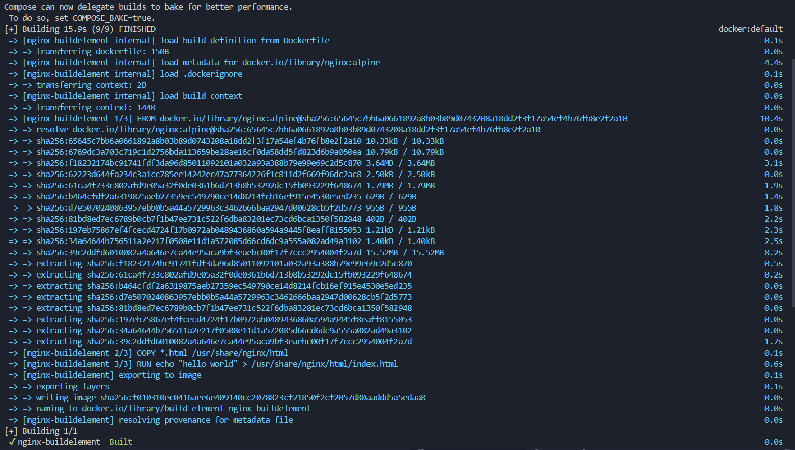
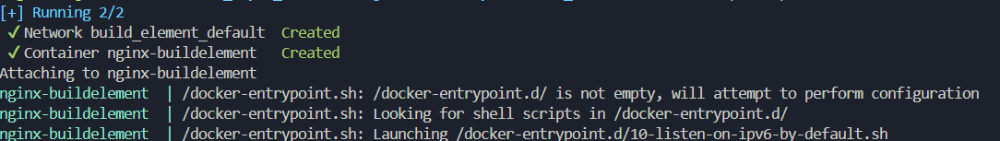
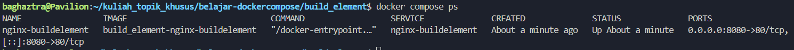
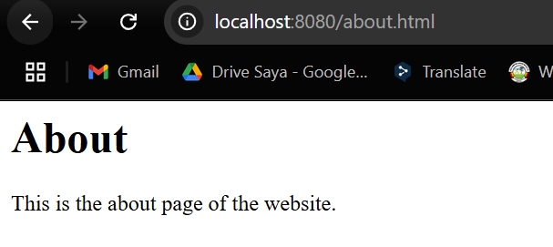
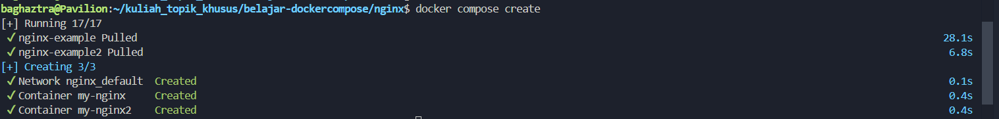
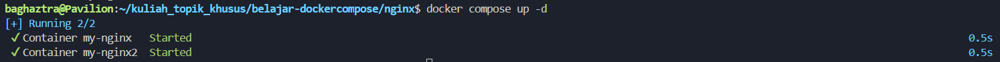
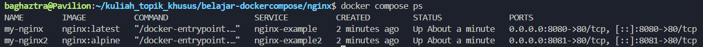
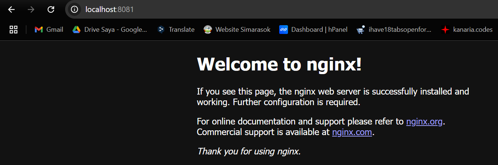
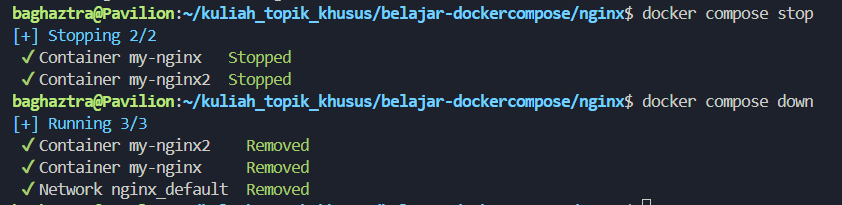

### 📚 Pertemuan ke-11 mata kuliah Topik Khusus

# Docker Compose

## 1. Build Element

```bash
cd build_element/
```

### Build

```bash
docker compose build
```



### Jalankan compose

```bash
docker compose up
```



### Lihat compose yg berjalan

```bash
docker compose ps
```



### Cek Hasilnya

Berdasarkan Dockerfile di `build_element`, semua hile .html dimasukkan, sehingga kita bisa cek, disini `/about.html` dari port `8080` (berdasarkan pengaturan di `docker-compose.yml`)



---

## 2. Build Element

```bash
cd nginx/
```

### Buat compose
```bash
docker compose create
```



### Jalankan compose
```bash
docker compose create
```
`-d` untuk menjalankan di background



### Lihat container yg aktif
```bash
docker compose ps
```




### Lihat di browser



### Matikan dan hapus



---

## 3. Node App

```bash
cd node_app/
```